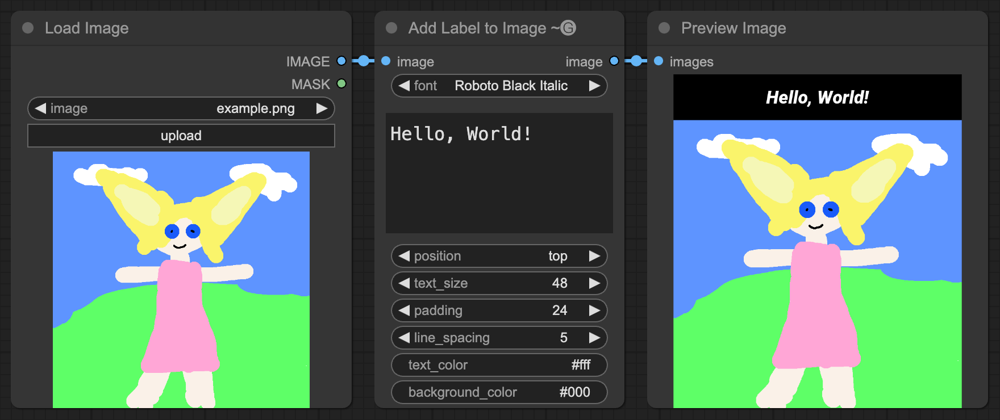

# ComfyUI-ImageLabel

A ComfyUI node that extends an image vertically to add a label either above or below it.



## Installation

### ComfyUI-Manager

- Open the manager
- Pick "Install via Git URL"
- Enter `https://github.com/Gremlation/ComfyUI-ImageLabel`

You may need to edit `custom_nodes/ComfyUI-Manager/config.ini` and set `security_level = normal-` first.

### Manual

Run the following commands in the terminal:

```shell
cd custom_nodes
git clone https://github.com/Gremlation/ComfyUI-ImageLabel
pip install -r ComfyUI-ImageLabel/requirements.txt
```

Then restart ComfyUI.
